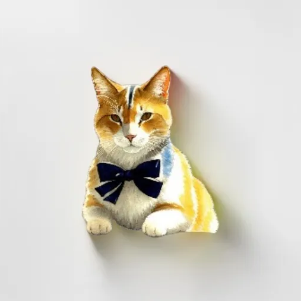

 
   

# Shadow Generator
A **Telegram-based** application that lets you **upload any image**, place it on a **light background**, and add **realistic shadows** (complete with reflections and a custom angle). Perfect for quick prototyping, product image enhancement, or artistic compositions.

## Demo

Try it out on Telegram:  
[**SoloStyleBot/app**](https://t.me/SoloStyleBot/app)

     

> 
      

---

## Features

- **Automated Object Detection**  
  Uses **BLIP-2** to describe the main object, **GroundingDINO** to detect bounding boxes, and **SAM** (Segment Anything) to generate a precise object mask.

- **Shadow Generation**  
  A **Pix2Pix**-based pipeline adds a natural-looking shadow under the cut-out object, complete with adjustable angle and soft reflections.

- **Lightweight Telegram Interface**  
  Simply send an image to the bot, optionally adjust the shadow angle, and receive a visually appealing result.

---

## Architecture Overview

1. **Telegram Mini-App**
   - A custom web application *embedded* directly inside Telegram via a web interface (powered by Gradio).

2. **Image Processing Pipeline**  
   - **BLIP-2**: Generates a textual description of the main object.  
   - **GroundingDINO**: Zero-shot detection from the BLIP-2 prompt.  
   - **SAM**: Precise segmentation to extract the object mask.  
   - **Pix2Pix**: Renders a shadowed composite on a bright background.

3. **Infrastructure**
   - **Yandex Cloud**: For hosting the Telegram Mini-App.  
   - **Local GPU Server**: Heavy computations via SSH tunneling.  
   - **Docker**: Containerized environment for deployment.

---

## Usage

1. **Send an image** to the Telegram bot.  
2. The bot **detects and segments** the main object.  
3. **Generates a shadow** at a default angle.  
4. (Optional) **Adjust shadow angle** 
5. Receive the **final composited image** on a light background with realistic shadow.

## Training 
- **Using generative dataset**

Render realistic shadows in 3d software

  
    -> 
  

